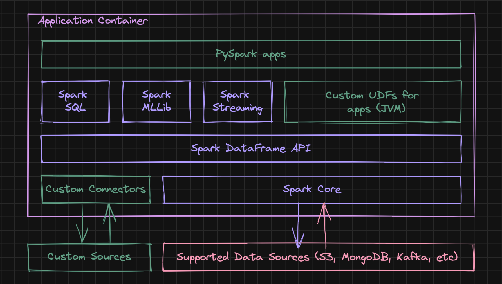

# Apache Spark Project Template

<table width="256px">
  <tr>
    <td></td>
  </tr>
  <tr><td align="center">App Container</td></tr>
</table>

## Background
In today's data-driven world, a collaboration between data engineers and data scientists is critical for the success of any data project. [Data engineers](https://en.wikipedia.org/wiki/Data_engineering) are responsible for designing and building the infrastructure required for data storage, processing, and transformation. [Data scientists](https://en.wikipedia.org/wiki/Data_science), on the other hand, are responsible for developing and deploying machine learning models and deriving insights from the data. To ensure productive collaboration between these two groups, there are some challenges to address: how they communicate, how they work on the same codebase, how they establish code quality standards, what common tools and frameworks they can use.   

## Programming Skills
Data scientists and data engineers work closely together in data-driven organizations, but usually, they have different skill sets. Data scientists are proficient in programming languages such as Python, R, and SQL to analyze data, build predictive models, and communicate insights. Data engineers are proficient in programming languages such as Java, Scala, and Python to build and maintain data pipelines and create data architecture. Productive collaboration between data engineers and data scientists is possible if they are using a framework that supports all (most) these programming languages.

## Apache Spark
[Apache Spark](https://spark.apache.org/) is a powerful open-source data processing framework that supports multiple programming languages, including Java, Scala, Python, SQL and R. Data scientists can use Apache Spark for various tasks such as data cleaning, feature engineering, model training, and evaluation. They can write code in Python or R using Spark's APIs to process large-scale data and build predictive models. Data engineers can use Apache Spark for tasks such as data ingestion, data transformation, and ETL (extract, transform, load) processes. They can write code in Scala or Java using Spark's APIs to build efficient data pipelines and process data in a distributed manner.

## Project Structure
This project is a GitHub project template, that is designed to help developers get started quickly with Apache Spark projects. This template provides a consistent structure for projects that use Python to develop Spark applications and use Scala to implement compute-intensive UDFs, custom Apache Spark connectors, and use/extend low-level Apache Spark resources.

